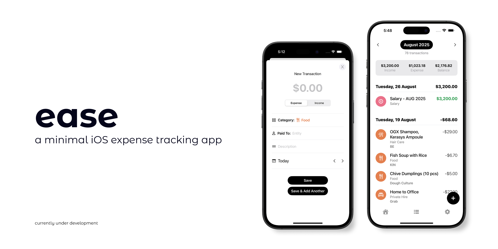

# Ease



## Overview

Ease is an iOS expense tracking app that lets you log transactions in seconds with smart autocomplete, duplicate past entries with a swipe, and catch up on days/weeks of expenses without the usual tedium.

Built with SwiftUI and SwiftData using MVVM architecture.

## Features

### App Walkthrough
`[TODO: Screen recording of the entire app walkthrough, starting with 0 transactions to demonstrate the entire journey]`

### Key Features: Transaction Tab
- **Create transactions** - Log your income and expenses with amount, categories, payees, and descriptions
`[TODO: include <= 5s gif of transaction list > tapping on + button > fill in trsn fields]`
- **Smart autocomplete** - Shows suggestions for payee names and descriptions based on transaction history
`[TODO: include <= 5s gif of autocomplete suggestions in my app]`
- **Save and Add Another Transaction** - Create new transactions without having to return to the Transaction tab
`[TODO: include <= 5s gif: tap Save and Add Another button from current transaction, and create new trsn]`
- **Quick Actions** — Swipe to duplicate or delete transactions
`[TODO: include <= 5s gif: swipe to duplicate trsn and save new trsn]`
`[TODO: include <= 5s gif: swipe to delete trsn]` --> show gifs side by side

## Motivation: Reducing Friction
While using a popular budgeting app, I found that recording daily habits — like my frequent bubble tea runs — required too much manual typing and too many taps (UX friction). As a result, I tend to forget what I want to record, and it discouraged me from using the app.

I wanted an app that is **beautiful** and **easy to use** - easy to record transactions, easy to know how much I earned and spent at a glance. The goal is to minimise mental load and maximise efficiency for users.

| Problem Identified | Problem Description |  My Solution |
| :------------- | :------------- | :------------- |
| **Single description field** | I can't separate the "What" (product/service) from "Where" (who I am buying from), and it's tedious to type these details out every transaction. | Have 2 fields: payee (`Paid To/Received From`), and description. |
| **Manual Description Entry** | Have to manually type the description for each transaction. Troublesome if you want to record similar purchases from different stores, or different orders from the same store. | Smart autocomplete suggestions for payee and description fields |
| **No duplication feature** | Recording similar transactions requires manual typing each time, or having to copy-paste the description from another similar transaction. | Swipe-to-duplicate feature where you can make edits before saving. |
| **Tedious to record multiple transactions** | If I have multiple transactions to create, I have to tap on the "+" button, record the details, press "Save", return to Transaction tab, then repeat. That's quite the hassle, especially when I want it to be fast. | Added "Save and Add Another" button so the user can continue creating the next transaction without visual interruption. |
| **No sticky headers** | Lose context on what you are reading, especially if a specific day has 3 or more transactions made. | Added sticky headers for transaction and category lists |

> **Efficiency win**: In internal testing for common transactions (e.g., food/drinks), Ease reduced recording time by about 18% compared to a popular budgeting app.

## Tech Stack
- Architecture: MVVM
- Data Persistence: SwiftData (local-only)
- UI Framework: SwiftUI (declarative UI)

## Project Structure

```
Ease/
├── Models/
│   ├── Transaction.swift
│   ├── TransactionCategory.swift
│   └── Payee.swift
├── View Models/
│   ├── TransactionViewModel.swift
│   ├── PayeeViewModel.swift
│   └── CategoryViewModel.swift
├── Views/
│   ├── Home Tab/
│   ├── Transaction Tab/
│   │   ├── Record Expense Sheet/
│   │   └── Transaction List/
│   └── Settings Tab/
├── Misc/
│   ├── AppError.swift
│   ├── TransactionTypeEnum.swift
│   └── Strings.swift
└── Assets.xcassets/
```

## Planned Features

- **Category management** - Allow users to create, edit and delete (CRUD) categories.
- **Dashboard analytics** - Interactive Swift Charts to show spending trends and category breakdowns.
- **Recurring transactions** - Handling user flow for recurring transactions.
- **Power tools** - CSV export and possible import.

## Requirements
- iOS 18.6+
- Xcode 26.0+
- Swift 5.9+

## Installation

1. Clone the repository:
   ```bash
   git clone https://github.com/dorcasshee/ease.git
   ```

2. Open the project in Xcode:
   ```bash
   cd Ease
   open Ease.xcodeproj
   ```

3. Select your target device or simulator

4. Build and run (⌘ + R)

## About the Developer

Hi, I'm **Dorcas Shee**, a junior iOS developer who's passionate about building intuitive, modern, and functional mobile experiences. I transitioned into iOS development during my tenure at Visa, where I worked on a native enterprise productivity iPad app for all employees that serves as a one-stop solution to internal tools, news, request approvals, etc.

Ease is my first independent iOS app project, built to improve my own expense tracking experience. Through this project, I continue to deepen my expertise in SwiftUI, SwiftData and the MVVM architecture.

If you have any questions regarding this app or would like collaborate on other projects, please contact me at dorcasshee@outlook.com. 😄
